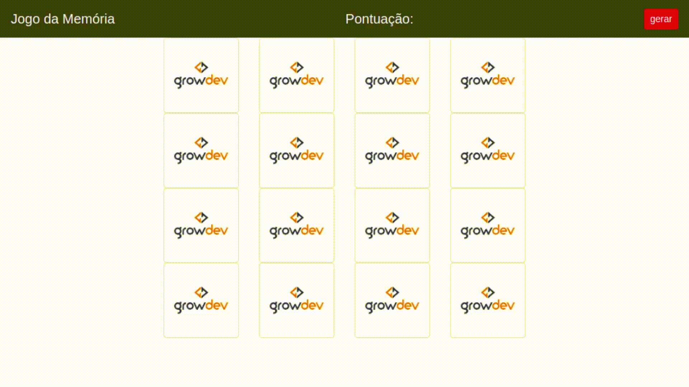

# Growdev

     

## Jogo da memória
Está versão foi desenvolvida apenas com os conhecimentos adquiridos até o momento. 

------------

## Sobre
 Este Jogo é Um Exercício Proposto Pelo Programa Starter Da [Growdev][grow]

------------

## Desenvolvimento

  
#####   📍   Criação da versão 1.0
#####  📘  Estudar o código e refatorar para criar versão 2.0
------------

## Contribuição

1. Faça o _fork_ do projeto (<https://github.com/william-ribeirojogoDaMemoria/fork>)
2. Crie uma _branch_ para sua modificação (`git checkout -b feature/fooBar`)
3. Faça o _commit_ (`git commit -am 'Add some fooBar'`)
4. _Push_ (`git push origin feature/fooBar`)
5. Crie um novo _Pull Request_

------------

## Contatos

 

------------

### Licença

Este projeto é desenvolvido sob a licença MIT. Veja o arquivo [LICENSE](LICENSE.md) para saber mais detalhes.

[grow]: https://www.growdev.com.br/ "Growdev"
